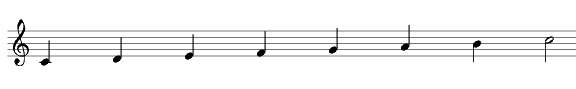

# ChucKing scores

I've been spending some time lately with [ChucK](https://chuck.cs.princeton.edu/), an audio programming language for real-time synthesis, composition, and performance. It is *libre* software ([free as in freedom](https://www.gnu.org/philosophy/free-sw.html)), and runs on macOS, Windows, Linux, and [The Web](https://chuck.cs.princeton.edu/webchuck).

Is it possible to play musical scores using ChucK? Although the main motivation of ChucK is algorithmic music, the answer is positive. The goal of this document is to show a proposal for a notation system allowing to write and play ChucK programs containing monophonic musical fragments. This could be useful for several reasons, not only in order to play scores. For example, it could be interesting for composers who wish to use predefined musical patterns in ChucK as building blocks for complex compositions, without limiting the ability of doing algorithmic transformations, and combining the patterns using mathematical rules or whatever. Chucking fugues, anyone?

A very simple approach to the problem is to write series of sentences assigning frequency and duration values for each note. For instance, this little ChucK program plays a well known melody.

```
    triosc s => dac;  
    .5 => s.gain;
    391.995436 => s.freq;  24000.000000::samp => now;
    440.000000 => s.freq;  24000.000000::samp => now;
    391.995436 => s.freq;  24000.000000::samp => now;
    523.251131 => s.freq;  24000.000000::samp => now;
    493.883301 => s.freq;  48000.000000::samp => now;
    391.995436 => s.freq;  24000.000000::samp => now;
    440.000000 => s.freq;  24000.000000::samp => now;
    391.995436 => s.freq;  24000.000000::samp => now;
    587.329536 => s.freq;  24000.000000::samp => now;
    523.251131 => s.freq;  48000.000000::samp => now;
    391.995436 => s.freq;  24000.000000::samp => now;
    783.990872 => s.freq;  24000.000000::samp => now;
    659.255114 => s.freq;  24000.000000::samp => now;
    523.251131 => s.freq;  24000.000000::samp => now;
    493.883301 => s.freq;  24000.000000::samp => now;
    440.000000 => s.freq;  96000.000000::samp => now;
    698.456463 => s.freq;  24000.000000::samp => now;
    659.255114 => s.freq;  24000.000000::samp => now;
    523.251131 => s.freq;  24000.000000::samp => now;
    587.329536 => s.freq;  24000.000000::samp => now;
    523.251131 => s.freq;  72000.000000::samp => now;
```

Anybody would be able to recognize, without executing the program, the music of "Happy Birthday"? No, right?. Well, it is not the Warner's property and famous song either, but another older work. This is one of the motivations for which it would be necessary to find an advisable and xpressive way to transcribe sheet music into ChucK programs.

Then, which features must have a musical representation for ChucK programs? First, it must be easily understandable by anybody familiarized with other musical notation systems. A list of frequencies and absolute times would be far from easy to whistle, without executing the program. On the other hand, when using a score as reference, the musician usually would like to do trasformations, as for example interpreting the piece with an air (speed) faster or slower than the specified by the author. The second common transformation is to transpose notes (shift or lower pitches), to change the tonality. These two transformations must be easy to do, with minimal changes to the programs.

Of course, a computer program is not a score. Nevertheless, examples of musical notation in computer languages exist that can fulfill the previous requirements. An example is the language used by the typesetting program [Lilypond](https://lilypond.org). Another one is the PLAY sentence of the old IBM PC BASIC language, that has inspired some cellular phone manufacturers for the tone generators programming, besides to [colonize](https://www.unix.com/man-page/freebsd/4/spkr/) some UNIX variants.

The proposal of this article is to use a syntax like this:

```
    // Major Scale of C.  Each note is a pair of [MIDI note number, duration] 
    [[c,4], [d,4], [e,4], [f,4], [g,4], [a,4], [b,4], [C,2]] @=> int MAJCScale[][];
```

The previous code fragment would be a representation of the following musical scale:



A monophonic melody fragment may be represented as a bidimensional array where the first dimension is a variable length note list, and the second dimension is a pair of numbers, of which the first one represents a MIDI note (an integer value between 0 and 127) and the second one represents a symbolic duration. In order to avoid direct use of MIDI note values, it is preferable to declare a series of constants using the common names of notes. For some countries, the following declarations may be convenient:

```
    // MIDI note constants
    60 => int c;     72 => int C;
    61 => int cs;    73 => int Cs;
    62 => int d;     74 => int D;
    63 => int ds;    75 => int Ds;
    64 => int e;     76 => int E;
    65 => int f;     77 => int F;
    66 => int fs;    78 => int Fs;
    67 => int g;     79 => int G;
    68 => int gs;    80 => int Gs;
    69 => int a;     81 => int A;
    70 => int as;    82 => int As;
    71 => int b;     83 => int B;
```

Instead of using small and capital letters, another variation would be to use octave numbers: 60 => int C4; 72 => int C5; and so on. The constant "Cs" means C-sharp, or "C#". An unavoidable matter for fashioned programmers and composers.

The representation of note durations is solved in the following way:

| Symbol | Musical Figure     |
|--------|--------------------|
| 1      | whole              |
| 2      | half               |
| 4      | quarter (crotchet) |
| 8      | eighth (quaver)    |
| ...    |                    |

The speed variations can be done manipulating the contents of a "tempo" variable. It contains the number of pulses per minute (BPM), or Maelzel Metronome units, called in honor of Johann Nepomuk Mälzel that did not invent the metronome, but made some money with the patent. Here is a table of some common *tempi* and the corresponding BPM values.

| Tempo      | BPM |
|------------|----:|
| Largo      | 40  |
| Adagio     | 60  |
| Moderato   | 80  |
| Allegretto | 100 |
| Allegro    | 120 |
| Presto     | 160 |

To obtain the value of the duration from the symbol, it requires only a simple calculation:

```
    // We use musical tempo, and symbolic durations
    120 => int tempo; // Maelzel Metronome units (quarters per minute)
    // integers 1,2,4,8 mean musical figures
    dur duration[9];
    240000::ms / ( 1 * tempo )  => duration[1]; // whole
    240000::ms / ( 2 * tempo )  => duration[2]; // half
    240000::ms / ( 4 * tempo )  => duration[4]; // quarter (crotchet)
    240000::ms / ( 8 * tempo )  => duration[8]; // eighth (quaver)
```

On the other hand, to fulfill the requirement of easy pitch transposition, there is another variable named "trans". The amount in semitones will be added to each MIDI note before calling to the standard ChucK function std.mtof() that returns the frequency in Hertz for its argument.

```
    // For transpose (pitch shift), if needed
    0 => int trans;
    // Play a single note
    fun void playNote( int n, int d ) {
        std.mtof(n + trans) => s.freq;
        duration[d] => now;
    }
```

Other transformations could be conceived but have not been explored in this article. For example, it could be implemented some time mechanism for inverse quantification, to make more interesting and less rigid the mechanic taste of computer musical interpretations. An interesting application would be the "swing" effect. Some included examples would benefit from ritardando effects. About frequency variations, all types of effects and ornaments would be interesting, like glissando, trills...

Finally, the examples illustrating this article have been made with the goal of great enjoyment, and with several approaching levels to the final solution. In an order of difficulty from minor to greater they are...

The basic code shown in this article, belongs to this example.

-   [scales.ck](scales.ck)

Simple examples. Single voice melodies

-   [chimes.ck](chimes.ck)
-   [wewish.ck](wewish.ck)
-   [morning.ck](morning.ck)

Examples of greater complexity. Two or more concurrent voices.

-   [Bach: Notebook for Anna Magdalena, no.4](anamag04.ck)
-   [Greensleeves](green.ck)
-   [Bach: BWV645](bwv645.ck)
-   [Pachelbel: Canon in D](canon.ck)

Some of the previous examples are based on scores published by the [Mutopia project](https://www.mutopiaproject.org). Bach's BWV645 can also be found in Mutopia, but here is a simplified version, with the corresponding score in [Lilypond format](bwv645.ly), and [PDF](bwv645.pdf) available.

You may want to [download a package](https://github.com/pedrolcl/chucking-scores/archive/refs/tags/v1.0.0.tar.gz) containing all the sample files and documents.

Copyright (c) 2006-2023 Pedro Lopez-Cabanillas <<plcl@users.sourceforge.net>>
Permission is granted to copy, distribute and/or modify this document under the terms of the GNU Free Documentation License, Version 1.2 or any later version published by the Free Software Foundation; with no Invariant Sections, no Front-Cover Texts, and no Back-Cover Texts. A copy of the license is included in the file [fdl.txt](fdl.txt) ("GNU Free Documentation License").
